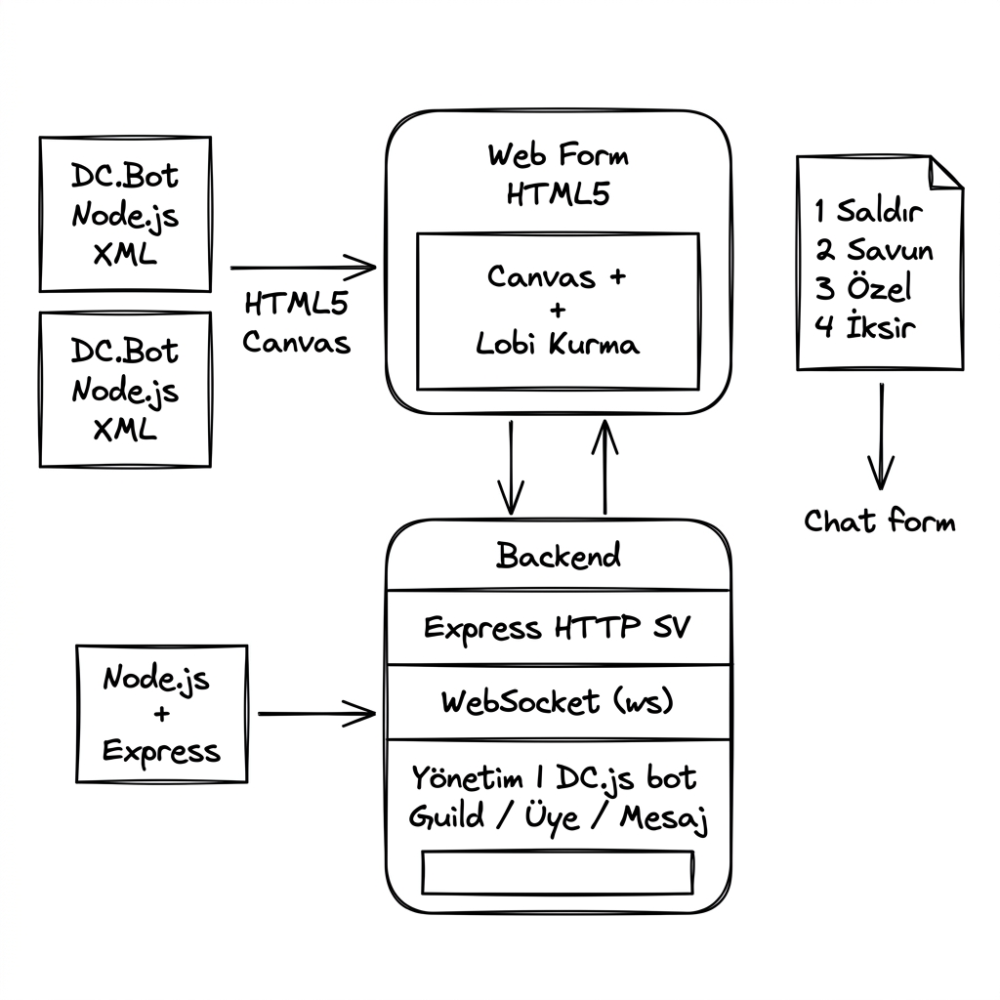

# 🎮 Discord Dungeon

> Discord sunucunun üyeleri canavar olarak karşına çıkıyor! Chat mesajlarıyla kahramanını kontrol et!


---

## 🌟 Özellikler

- 🧌 **Discord üyeleri = Canavarlar** — Sunucunun tüm üyeleri Discord adı ve avatarıyla canavar olarak oyunda!
- 👑 **Rol bazlı güç sistemi** — Admin = Ejderha Boss, Moderatör = Ork Elite, normal üyeler = çeşitli yaratıklar
- 🗳️ **Twitch Plays tarzı oylama** — Herkes `1` `2` `3` `4` yazar, çoğunluk kazanır (5 saniye oy penceresi)
- 🎨 **Canvas tabanlı oyun motoru** — Procedural karakter çizimleri, partikül efektleri, animasyonlar
- ⚡ **Gerçek zamanlı** — WebSocket ile anlık güncelleme
- 🔥 **Dark fantasy tasarım** — Glassmorphism, neon efektler, animasyonlar

---

## 🏗️ Mimari Diyagram

> Projenin el çizimi mimarisi — Discord bot, backend ve frontend nasıl bağlanıyor?



**Akış özeti:**
- 🖥️ **Web Form (HTML5)** — Canvas oyun alanı + Lobi kurma formu
- ⚙️ **Backend (Node.js + Express)** — HTTP sunucu, WebSocket (ws), DC.js bot yönetimi
- 🤖 **Discord Bot** — Guild üyeleri, üye listesi ve kanal mesajları
- 💬 **Chat Komutları** — `1` Saldır · `2` Savun · `3` Özel · `4` İksir → Chat form üzerinden oyuna iletilir

---

## 🎮 Nasıl Oynanır?

Discord kanalına şu komutları yaz:

| Komut | Eylem |
|-------|-------|
| `1` | ⚔️ Normal Saldırı |
| `2` | 🛡️ Savunma (Mana yeniler, hasarı azaltır) |
| `3` | 🔥 Büyülü Saldırı (20 Mana gerektirir) |
| `4` | 💊 İksir Kullan (Stok gerektirir) |

**5 saniye** içinde en çok yazılan komut uygulanır. Canavar da karşılık verir!

---

## 🚀 Kurulum

### 1. Gereksinimler
- Node.js 18+
- Discord Bot Token

### 2. Kurulum

```bash
git clone https://github.com/Pargusz/discordoyun.git
cd discordoyun
npm install
```

### 3. Discord Bot Kurulumu

1. [Discord Developer Portal](https://discord.com/developers/applications) → **New Application**
2. **Bot** bölümü → **Add Bot**
3. **Privileged Gateway Intents** altında şunları aç:
   - ✅ **Server Members Intent**
   - ✅ **Message Content Intent**
4. **Reset Token** → Token'ı kopyala
5. **OAuth2 → URL Generator** → `bot` + `Administrator` izni seç → Botu sunucuna ekle

### 4. Çalıştır

```bash
npm start
```

Tarayıcıda `http://localhost:3000` aç.

### 5. Lobi Oluştur

Web arayüzünde şunları gir:
- **Kahraman Adı** — İstediğin isim
- **Bot Token** — Discord Developer Portal'dan
- **Sunucu (Guild) ID** — Sunucuya sağ tıkla → ID Kopyala
- **Kanal ID** — Oyun kanalına sağ tıkla → ID Kopyala

**"ZINDANA GİR"** tıkla ve oyun başlar! 🎮

---

## 🏗️ Proje Yapısı

```
discordoyun/
├── server.js              # Ana server (Express + WebSocket)
├── package.json
├── .env.example
├── src/
│   ├── bot.js             # Discord.js bot (üye çekme + mesaj dinleme)
│   └── gameEngine.js      # Oyun motoru (savaş, oylama, level sistemi)
└── public/
    ├── index.html         # Ana oyun sayfası
    ├── css/
    │   └── style.css      # Dark fantasy CSS
    └── js/
        ├── canvas.js      # HTML5 Canvas renderer
        ├── ui.js          # HUD & event yöneticisi
        └── lobby.js       # WebSocket bağlantısı
```

---

## 🐉 Canavar Tipleri

| Tür | Temel Canavar | Güç |
|-----|---------------|-----|
| Sunucu Üyesi | Goblin / Slime / Yarasa / Zombi / Örümcek | ⭐ |
| Çok Rollü Üye | İskelet Savaşçı | ⭐⭐ |
| Moderatör | Ork Elite | ⭐⭐⭐ |
| Admin | 🐉 Ejderha BOSS | ⭐⭐⭐⭐⭐ |

---

## ⚙️ Geliştirme

```bash
# Geliştirme modunda çalıştır
npm run dev
```

---

## 📝 Lisans

MIT License
